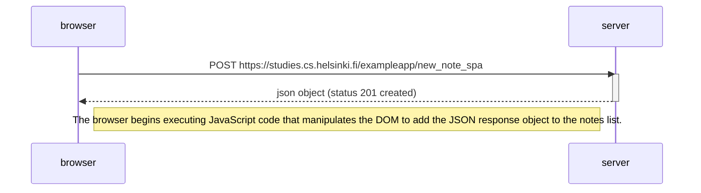

```mermaid
sequenceDiagram
    participant browser
    participant server

    browser->>server: POST https://studies.cs.helsinki.fi/exampleapp/new_note_spa
    activate server
    server-->>browser: json object (status 201 created)
    deactivate server

    Note right of browser: The browser begins executing JavaScript code that manipulates the DOM to add the JSON response object to the notes list.
```